# Cloudflare Containers Demo

[Cloudflare Containers](https://developers.cloudflare.com/containers/) let you run code written in any programming language, built for any runtime, as part of apps built on [Workers](https://developers.cloudflare.com/workers).  You can read more about the roadmap on the [Cloudflare Blog](https://blog.cloudflare.com/tag/containers/).

With Containers you can run:

* Resource-intensive applications that require CPU cores running in parallel, large amounts of memory or disk space

* Applications and libraries that require a full filesystem, specific runtime, or Linux-like environment

* Existing applications and tools that have been distributed as container images

## Sample App
Checkout the sample [Titanic Survival Prediction App](https://containers-demo.fusecloud.workers.dev/) to see how we are running an ML model in a Cloudflare Container on the edge.

## Architecture

The following diagram shows the request flow from client to container, and how the worker maintains containers through scheduled jobs:

```mermaid
%%{init: {'theme':'base', 'themeVariables': {'primaryColor': '#ffffff', 'primaryTextColor': '#666666', 'primaryBorderColor': '#999999', 'lineColor': '#666666', 'arrowheadColor': '#666666', 'edgeLabelBackground': '#ffffff', 'clusterBkg': '#ffffff', 'background': '#ffffff', 'mainBkg': '#ffffff', 'secondBkg': '#ffffff', 'tertiaryBkg': '#ffffff'}}}%%
graph LR
    Client["🌐 Client"]
    Worker["⚡ Cloudflare Worker<br/>(Hono App)"]
    DO["🏠 Durable Object<br/>(FastAPIContainer)"]
    Container["🐳 Container<br/>(FastAPI App)"]

    %% Request Flow (1-4)
    Client -->|"1️⃣ HTTP Request<br/>/api/*"| Worker
    Worker -->|"2️⃣ getContainer()<br/>Forward Request"| DO
    DO -->|"3️⃣ container.fetch()<br/>Proxy to Container"| Container
    
    %% Response Flow (4-6)
    Container -.->|"4️⃣ FastAPI Response<br/>JSON/HTML"| DO
    DO -.->|"5️⃣ Proxy Response<br/>Back to Worker"| Worker
    Worker -.->|"6️⃣ HTTP Response<br/>To Client"| Client

    %% Scheduled Container Management (Bottom)
    Scheduler["⏰ Cron Scheduler<br/>(Every 2 minutes)"]
    
    Scheduler ==>|"🔄 Trigger Cron Job"| Worker
    Worker ==>|"🚀 container.start()<br/>Pre-warm Container"| DO
    DO ==>|"⚡ Start/Keep Alive"| Container

    %% Styling
    classDef clientStyle fill:#e1f5fe,stroke:#01579b,stroke-width:2px
    classDef workerStyle fill:#f3e5f5,stroke:#4a148c,stroke-width:2px
    classDef doStyle fill:#e8f5e8,stroke:#1b5e20,stroke-width:2px
    classDef containerStyle fill:#fff3e0,stroke:#e65100,stroke-width:2px
    classDef schedulerStyle fill:#fce4ec,stroke:#880e4f,stroke-width:2px

    class Client clientStyle
    class Worker workerStyle
    class DO doStyle
    class Container containerStyle
    class Scheduler schedulerStyle
```



### Request Flow
1. **Client** sends HTTP requests to `/api/*` endpoints
2. **Cloudflare Worker** (Hono app) receives and routes the requests
3. **Durable Object** (FastAPIContainer) acts as a container manager and proxy
4. **Container** (FastAPI app) processes the actual business logic
5. Responses flow back through the same chain

### Scheduled Container Management
- A **Cron Scheduler** runs every 2 minutes to keep containers warm
- It triggers the Worker to pre-warm containers via the Durable Object
- This ensures containers are ready to handle incoming requests quickly

## Future Roadmap

Containers has some exciting future features announced on their roadmap.

* **Higher limits and larger instances** 

    * Current limits: 40 GiB memory and 40 vCPU total. Select customers already scale to thousands of containers. Limits will be raised in coming months for larger workloads.

* **Global autoscaling and latency-aware routing**

    * Future: Global autoscaling and routing to nearest container instances. Enable with a single line of code for automatic load balancing.

```javascript
class MyBackend extends Container {
  defaultPort = 8080;
  autoscale = true; // global autoscaling on - new instances spin up when memory or CPU utilization is high
}

// routes requests to the nearest ready container and load balance globally
async fetch(request, env) {
  return getContainer(env.MY_BACKEND).fetch(request);
}
```

* **More ways to communicate between Containers and Workers** 

    * Enhanced Worker-Container communication: exec commands, HTTP handlers, bindings to Cloudflare services via Volumes and programmatic setup. 

## Pricing & Instance Types

### Available Instance Types

| Name | Memory | CPU | Disk |
|------|--------|-----|------|
| dev | 256 MiB | 1/16 vCPU | 2 GB |
| basic | 1 GiB | 1/4 vCPU | 4 GB |
| standard | 4 GiB | 1/2 vCPU | 4 GB |

### Billing Model

Pay-per-use billing: charges start when containers receive requests or are manually started, stop when containers sleep after timeout. Enables easy scale-to-zero with high utilization for bursty traffic.

### Compute Pricing (per 10ms)

| Resource | Rate | Workers Standard Included |
|----------|------|--------------------------|
| Memory | $0.0000025 per GiB-second | 25 GiB-hours |
| CPU | $0.000020 per vCPU-second | 375 vCPU-minutes |
| Disk | $0.00000007 per GB-second | 200 GB-hours |

### Egress Pricing

| Region | Rate per GB | Workers Standard Included |
|--------|-------------|--------------------------|
| North America & Europe | $0.025 | 1 TB |
| Australia, New Zealand, Taiwan, Korea | $0.050 | 500 GB |
| Everywhere else | $0.040 | 500 GB |

